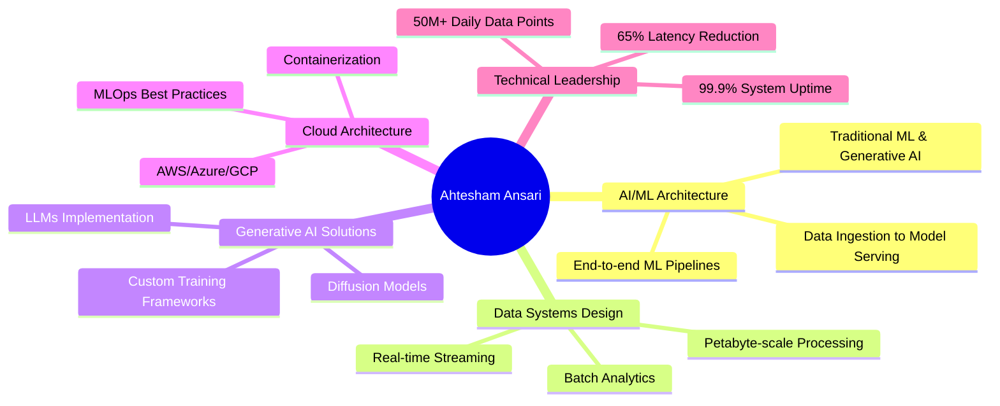

# 👋 Hi, I'm Ahtesham Salamat Ansari

<div align="center">


[](https://www.linkedin.com/in/ahteshamsalamatansari)
[](mailto:AhteshamSalamat@yahoo.com)
[](tel:+917415995966)

</div>

---

## 🚀 About Me

> **Architecting the Future with AI & Data** 🎯

I'm a passionate **Technical Solutions Architect** specializing in AI/ML Systems and Data Pipeline Design, based in **Burhanpur, Madhya Pradesh, India** 🇮🇳. With 4+ years of experience in data research and quality assurance, I've successfully transitioned into designing and implementing cutting-edge AI solutions that drive measurable business value.

<details>
<summary>📊 <b>Quick Stats</b></summary>

```text
🏗️  ML Pipelines Processed    : 50M+ data points daily
⚡  Inference Latency Reduced  : 65%
🎯  Model Deployment Time      : Weeks → Hours
📈  Lead Qualification Accuracy: +35% improvement
💾  Daily Data Ingestion       : 10TB+
🔄  System Uptime             : 99.9%
📞  API Calls Supported       : 10K+ daily
```

</details>

---

## 🛠️ Technology Arsenal

### 🧠 AI/ML & Data Science
<div align="center">


</div>

### ☁️ Cloud & Infrastructure
<div align="center">


</div>

### 🗄️ Data Engineering & Analytics
<div align="center">


</div>

### 📊 Monitoring & MLOps
<div align="center">


</div>

### 💻 Programming Languages
<div align="center">


</div>

---

## 💼 Professional Journey

<details open>
<summary>🏢 <b>BizProspex</b> - Technical Solutions Architect & Competitive Intelligence Specialist</summary>

### 🔧 Technical Solutions Architect (Aug 2025 - Present)
**Location:** Burhanpur, Madhya Pradesh, India

**🎯 Key Achievements:**
- 🏗️ **Architected scalable AI/ML training pipelines** processing **50M+ data points daily** with **99.9% uptime**
- ⚡ **Reduced training time by 40%** through optimized pipeline architecture
- 🤖 **Built generative AI solutions** using LLMs improving lead qualification accuracy by **35%**
- 📊 **Designed real-time streaming architecture** with Apache Kafka & Spark for sub-second analytics
- 🚀 **Implemented MLOps frameworks** reducing time-to-production by **60%**
- 💼 **Collaborated with sales/marketing teams** contributing to **25% increase in pipeline conversion**
- 🔒 **Implemented GDPR & CCPA compliant systems** with advanced encryption

### 🕵️ Competitive Intelligence Specialist (Feb 2025 - Aug 2025)
- 🔍 Deep-dive competitive research and market analysis for actionable B2B insights
- 🛠️ Leveraged LinkedIn Sales Navigator, Salesforce, and HubSpot CRM
- 📋 Created detailed competitor profiles supporting GTM strategies
- 🎯 Delivered account-based intelligence for targeted outreach
- 📊 Applied QA protocols maintaining high data accuracy
- 🚀 Supported ABM campaigns aligning insights with sales initiatives

</details>

<details>
<summary>🏢 <b>FunnelByte</b> - Project Leader & Quality Analyst (3 years 9 months)</summary>

### 👨‍💼 Project Leader & Quality Analyst (Nov 2022 - Feb 2025)
- 🎯 Designed and created quality plans adhering to organizational policies
- 🔧 Implemented error-fixing plans ensuring performance, reliability, and compatibility
- 🛠️ Expertise in QA testing tools and various extensions
- 📊 Root cause analysis and statistical collection for project optimization
- 📉 Achieved reduction in employee attrition rates
- 🎓 Knowledge transfer to new joiners and team management
- 💡 Provided efficient solutions for workplace challenges

### 📊 Senior Data Research Executive (Mar 2022 - Nov 2022)
- 🔬 Supervised and coordinated research and program evaluation activities
- 🤝 Collaborated with evaluators on data collection and analysis
- 📈 Developed policy and action suggestions based on research analytics
- 🏗️ Business analysis, data modeling, and database optimization
- 📋 Created and maintained centralized data dictionary
- 📊 Ensured data architectural guidelines compliance

### 🔍 Data Research Executive (Jun 2021 - Mar 2022)
- ⛏️ Led data mining and collection procedures from various sources
- ✅ Ensured data quality and integrity
- 📊 Built analytic systems and predictive models
- 📈 Created data visualizations and reports
- 🧪 Experimented with new models and techniques

</details>

<details>
<summary>🏢 <b>MPOnline Limited</b> - Kiosk Operator (Oct 2019 - Mar 2021)</summary>

### 🖥️ Kiosk Operator
- 🌐 Provided online services and bank correspondence
- 🎓 Conducted student seminars for government vacancies
- 🏥 **Enrolled 20,000+ local citizens** for Aayushman Bharat Yojana
- 📍 **Location:** Burhanpur, Madhya Pradesh, India

</details>

---

## 🎓 Education

<div align="center">

### 🏛️ Devi Ahilya Vishwavidyalaya (DAVV), Indore
**Bachelor of Business Administration - BBA (Honors)**  
📅 *July 2019 - July 2022*

### 🏫 St. Theresa Sr. Sec. School, Burhanpur
**10+2 Education**  
📅 *July 2016 - August 2019*

</div>

---

## 🏆 Achievements & Recognition

<div align="center">


</div>

---

## 📈 Core Expertise Areas



---

## 🌟 What I Bring to the Table

<div align="center">

| 🎯 **Core Strengths** | 📊 **Impact Metrics** |
|:---|:---|
| **AI/ML Pipeline Architecture** | 50M+ data points processed daily |
| **System Optimization** | 65% latency reduction achieved |
| **MLOps Implementation** | Weeks → Hours deployment time |
| **Data Infrastructure Design** | 10TB+ daily ingestion capacity |
| **Generative AI Solutions** | 35% accuracy improvement |
| **Team Collaboration** | 25% pipeline conversion increase |

</div>

---

## 🎯 Mission Statement

> *"Passionate about democratizing AI adoption and helping organizations unlock the potential of their data through intelligent architecture. Whether you're scaling existing ML operations or starting your AI transformation journey, I bring the technical expertise and strategic thinking to make it successful."*

---

## 📞 Let's Connect!

<div align="center">

**Ready to discuss your next AI/ML architecture challenge?**

[](https://www.linkedin.com/in/ahteshamsalamatansari)
[](mailto:AhteshamSalamat@yahoo.com)
[](https://wa.me/917415995966)

**📍 Based in Burhanpur, Madhya Pradesh, India 🇮🇳**

---

*Let's explore how intelligent data systems can accelerate your business objectives!* 🚀

</div>

---

<div align="center">


</div>

---

<div align="center">

</div>

<div align="center">

</div>

<div align="center">

</div>

---

<div align="center">

**⭐ Star this repository if you found my profile interesting!**

*Built with ❤️ and lots of ☕*

</div>
